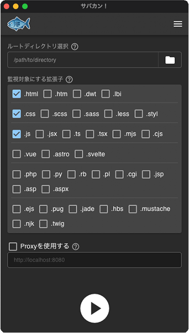
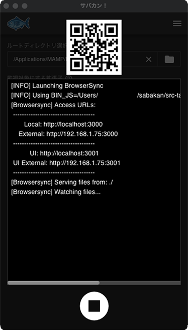

# 🐟 Sabakan!
[日本語版READMEはこちら](./README.md)

<a href="https://apps.microsoft.com/detail/9mzwkjrsh6dr" target="_blank">
    
</a>
<a href="https://apps.apple.com/jp/app/サバカン/id6748916636" target="_blank">
    
</a>

## 🐟 Project Overview
**Sabakan!** is a Tauri application that allows you to easily launch a live reload server from a graphical user interface (GUI).  
Under the hood, it uses **[Browsersync](https://browsersync.io/)**.

## 🐟 Features
- Start a Browsersync server with a single click
- Instantly access from smartphones or tablets via QR code display
- No need for a complex Node.js environment setup
- Supports both macOS and Windows

*Note: "QR Code" is a registered trademark of DENSO WAVE INCORPORATED.*

## 🐟 How to Use
1. Select the root directory  
2. Choose the file extensions you want to watch
3. If you want to live reload a local site built with WordPress, Docker, etc., check "Use Proxy" and enter the local site's URL
4. Press the ▶️ button

<table>
    <tr>
        <td></td>
        <td style="font-size: 2em; text-align: center;">➡️</td>
        <td></td>
    </tr>
</table>

## 🐟 Running in Development Environment
0. Prepare an environment where Tauri can be run

1. Install the library for displaying licenses  

```
cargo install --locked cargo-about
```
This will be installed globally.

2. Set up Node.js for Browsersync (macOS only)
   1. Download the Node.js binary suitable for your OS from [https://nodejs.org/en/download](https://nodejs.org/en/download)  
      (Look for "Standalone binaries" near the bottom of the page)

   2. Extract and rename the folder to `node`, then place it in `src-tauri/bin` so that the directory structure looks like this:
      ```
      src-tauri/bin
      ├── browser-sync
      ├── browser-sync.cmd
      └── node
          ├── bin
          ├── include
          ├── lib
          ├── share
          ├── CHANGELOG.md
          ├── LICENSE
          ├── package.json
          └── README.md
      ```

   3. Install Browsersync

      Using `src-tauri/bin/node`:
      ```
      npm install
      ```

3. Install packages  
In the root directory `/sabakan`:
```
pnpm install
pnpm tauri dev
```

## 🐟 License
This project is released under the MIT License.  
However, it uses Browsersync internally.  
For details, please refer to the NOTICE file.