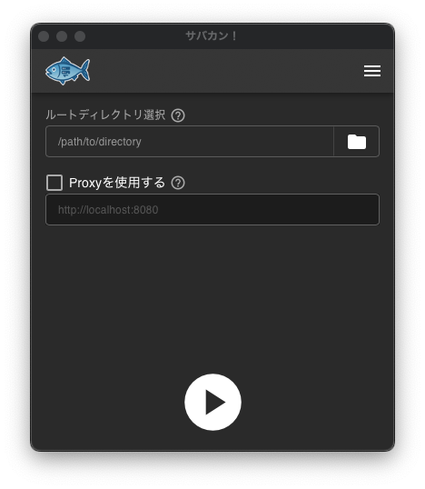
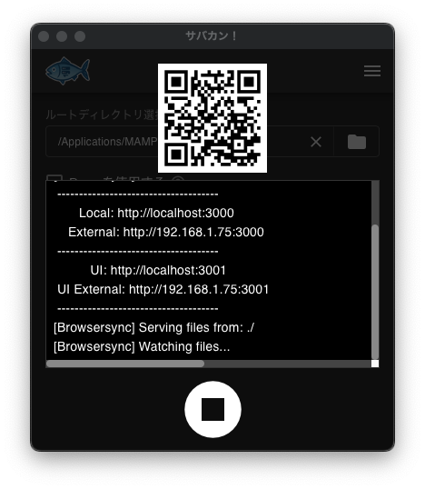

# 🐟 サバカン！

<a href="https://apps.microsoft.com/detail/9mzwkjrsh6dr" target="_blank">
    
</a>
<a href="https://apps.apple.com/jp/app/サバカン/id6748916636" target="_blank">
    
</a>

## 🐟 プロジェクト概要
「サバカン！」は、GUIからカンタンにライブリロードサーバーを起動できる Tauri アプリです。  
内部的には **[Browsersync](https://browsersync.io/)** を使用しています。

## 🐟 特徴
- ワンクリックで Browsersync サーバーを起動
- QRコード表示機能により、スマホやタブレットから即アクセス可能
- 複雑な Node.js 環境設定不要
- macOS / Windows 両対応

※「QRコード」は株式会社デンソーウェーブの登録商標です


## 🐟 操作方法
- ルートディレクトリを選択します  
  選択したディレクトリ内の、`.html`、`.css`、`.js`、`.php`ファイルを更新するとブラウザがリロードされます
- WordPressなどをライブリロードしたい場合は、「Proxyを使用する」にチェックを入れてローカルサイトのURLを入力します
- ▶️ ボタンを押します

<table>
    <tr>
        <td></td>
        <td style="font-size: 2em; text-align: center;">➡️</td>
        <td></td>
    </tr>
</table>


## 🐟 開発環境での実行
0. Tauriを実行できる環境を用意

1. ライセンス表示のためのライブラリをインストール  

```
cargo install --locked cargo-about
```
グローバルにインストールされます

2. Browsersync 用 Node.js の設置  (macOSのみ)
   1. [https://nodejs.org/ja/download](https://nodejs.org/ja/download) から実行OSにあったNode.jsのバイナリをダウンロードします  
      (ページ下の方の「スタンドアローンのバイナリー」)

   2. 解凍して`node`にリネームし、以下のようなディレクトリ構成になるように`src-tauri/bin`に置きます
      ```
      src-tauri/binaries
      ├── browser-sync
      ├── browser-sync.cmd
      └── node
          ├── bin
          ├── include
          ├── lib
          ├── share
          ├── CHANGELOG.md
          ├── LICENSE
          ├── package.json
          └── README.md
      ```

   3. Browsersyncのインストール

      `src-tauri/bin/node`で
      ```
      npm install
      ```

3. パッケージのインストール  
ルートディレクトリ`/sabakan`で
```
pnpm install
pnpm tauri dev
```

## 🐟 ライセンス
このプロジェクトは MIT ライセンスの下で公開されています。  
ただし内部的に Browsersync を利用しています。  
詳細は NOTICE を参照してください。
